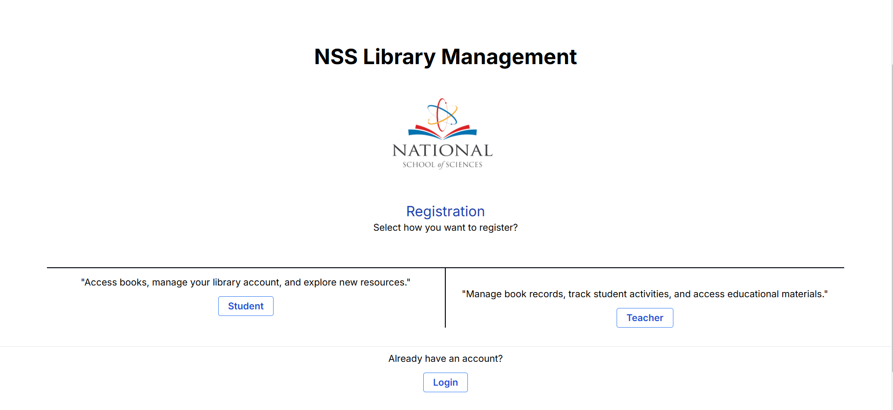
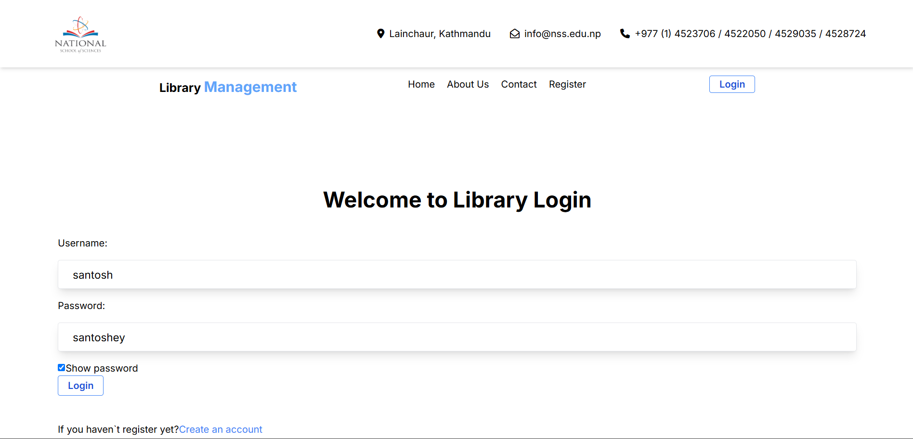
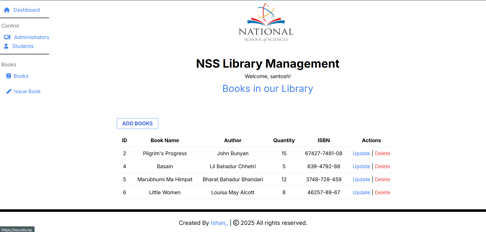
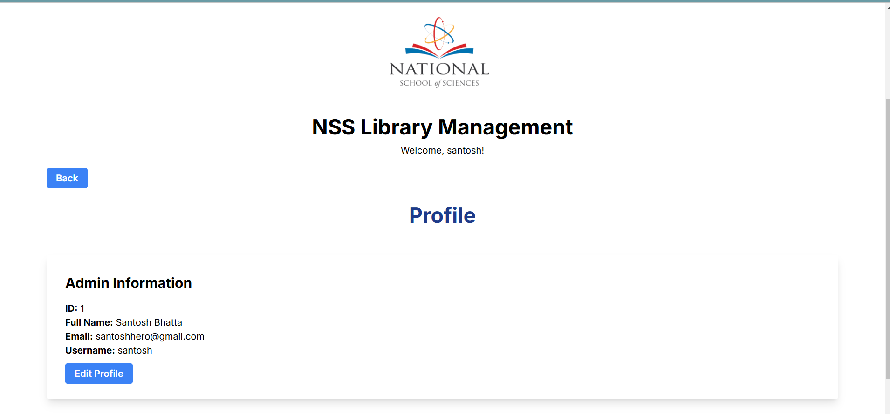

# 📚 Library Management System  

A **Library Management System** built using **PHP, MySQL, and Tailwind CSS** to efficiently manage books, students, and library operations.  

## 🚀 Features  

### 🔐 Authentication & User Roles  
- **Student & Admin Login** with authentication  
- Alerts for incorrect credentials  
- Redirects upon successful login  

### 📊 Admin Dashboard  
- Displays total **students, admins, books, and issued books**  
- Manage **students** (Add, Update, Delete)  
- Manage **books** (Add, Update, Delete)  

### 👨‍🎓 Student Section  
- View and manage **student details**  
- Check available books in the library  

### 📖 Book Management  
- Add, update, delete, and track book details  

### 🔍 User Profile  
- View personal **issued books & available books**  

---

## 🛠️ Tech Stack  

- **Backend:** PHP  
- **Database:** MySQL  
- **Frontend:** Tailwind CSS  
- **Other Tools:** XAMPP (for local development)  

---

## 🎮 Installation & Setup  

### 🔧 Prerequisites  
Ensure you have the following installed:  
- XAMPP or any local server  
- MySQL Database  

### 📥 Steps to Run the Project  

1️⃣ Clone the repository:  

git clone : https://github.com/ishan01-lx/library.git


2️⃣ Move the project folder to your server’s root directory (`htdocs` for XAMPP).  

3️⃣ Import the database:  
   - Open **phpMyAdmin**  
   - Create a new database (library)  
   - Import the `library_db.sql` file from the project folder  

4️⃣ Update database connection settings in `config.php`:  
```php
$host = "localhost";
$username = "root";  // Default for XAMPP
$password = "";
$database = "library";
```  

5️⃣ Start XAMPP and run the server:  
   - Open [http://localhost/library-management-system](http://localhost/library-management-system) in your browser  

---

## 📸 Screenshots  
### 🏠 Home Page
 

### 📝 Registration Page
 

### 🔐 Login Page  
   

### 📖 Books Management  
 

### 👤 Profile Page
 


---

## 🤝 Contributing  

Feel free to contribute by:  
- Reporting issues  
- Suggesting new features  
- Improving code and documentation  

---

## 📩 Contact  

For queries or collaboration, reach out to me on:  
📧 Email: ishan12chhetri@gmail.com
🔗 LinkedIn: https://www.linkedin.com/in/ishan-sitaula-5468b3318/  

---

⭐ **If you found this project helpful, don’t forget to give it a star!** ⭐  
